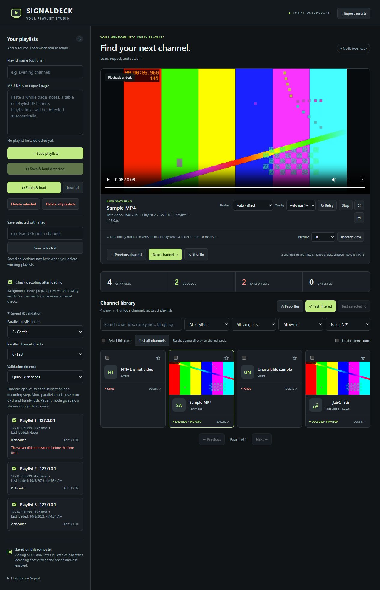

<p align="center"></p>

# 📺 SignalDeck

**Your local playlist studio. Import, compare, preserve, and watch M3U & HLS streams.**

Paste an entire page of playlist links, load them in the background, and see channels and quality results as they arrive. SignalDeck runs on your computer with no account or cloud service.



## 🚀 Start watching

1. Install **Node.js 20 or newer**.
2. Download or clone this repository.
3. Double-click **start.bat**. First launch installs the locked dependencies and bundled media tools.
4. Open **http://127.0.0.1:8787**, paste your links, and click **Save & load detected**.

Keep the server window open while watching. **Ctrl+C** stops it. Starting the launcher again opens an existing player.

Prefer a terminal?

```sh
npm ci
npm start
```

## ✨ Features

| Feature | What you get |
| --- | --- |
| 📋 Whole-page import | Detect M3U/M3U8 links among notes, tables, Markdown, and copied HTML hyperlinks. Trim spaces and remove duplicates. |
| 🔗 Flexible sources | M3U playlists, single HLS streams, and provider endpoints. GitHub file links become raw URLs. |
| ⚡ Growing queues | Add more batches while earlier loads and checks run. Pending duplicates are skipped; channels appear as each source finishes. |
| 🔬 Real validation | Inspect codecs and quality, decode frames or audio, and see previews and results on channel cards. |
| 🎚️ Speed controls | Adjustable parallel loads, parallel checks, and timeouts. |
| ▶️ Comfortable playback | HLS quality choices, compatibility fallback, fullscreen, picture in picture, theater view, and fit/fill controls. |
| 🔀 Quick switching | Previous, Next, and Shuffle follow your filters and skip failed checks. Shortcuts: **N / P / S**. |
| 🏷️ Preserved collections | Tag selected playlists and keep them separately, even after clearing the working library. |
| 🧹 Batch cleanup | Delete selected or delete all. Undo restores the last deleted batch alongside remaining playlists. |
| 🔎 Filters & export | Search names, categories and languages; filter favorites and results; export reports or an individual channel. |

## ⚡ Speed & validation

Open **Speed & validation** in the sidebar. Settings persist across restarts and apply to queued work. Lowering parallelism lets active tasks finish before more start.

| Setting | Choices | Default |
| --- | --- | --- |
| Parallel playlist loads | 2, 4, 6, 8 | 6 |
| Parallel channel checks | 2, 4, 6, 8 | 4 |
| Validation timeout | Quick: 8s · Balanced: 16s · Patient: 30s | Balanced |

Timeout applies separately to inspection and decoding; a full check may take up to two timeout periods. Quick mode moves through unresponsive streams faster. Patient mode gives slow streams longer. More parallel checks use more CPU, bandwidth, and provider connections.

Enable **Check decoding after loading** to queue channels from each completed playlist. **Test all channels** checks the entire library regardless of filters. **Test filtered** and **Test selected** target smaller sets. A compact progress strip shows active and queued counts and lets you stop either queue; results stay on the cards.

## 🏷️ Keep the good ones

1. Check the playlists you want to preserve.
2. Enter a tag such as **Germany HD** and click **Save selected**.
3. Delete working playlists whenever needed.
4. Click **Load saved** to bring a preserved collection back.

Collections preserve URLs, loaded channels, favorites and results across restarts. Loading restores a saved snapshot; **Fetch & load** refreshes provider content. **Undo delete** is separate and retains only the latest deleted batch. Existing URLs are not duplicated when restoring.

## 🔬 Understanding results

- **Decoded:** a video frame or audio sample decoded successfully when tested.
- **Failed:** no usable sample arrived within the limits, or the provider returned an error.
- **Inconclusive:** basic reachability was checked, but decoding tools were unavailable.

Quality metadata includes resolution, frame rate, codecs and reported bitrate. Unknown fields stay unknown. A successful sample does not guarantee long-term stability. Protected, expired, geographically restricted or provider-blocked streams may remain unavailable. SignalDeck does not supply channels, accounts, or bypass access restrictions.

## 💾 Storage & repository hygiene

The library, collections, settings and results live in **data/library.json**. The latest deleted batch lives in **data/deleted-playlists.json**; previews live in **data/thumbnails/**. Back up **data/** to preserve everything.

Provider URLs may contain credentials. **data/**, **node_modules/**, logs and generated **test-output/** are excluded by `.gitignore`; keep them out of public repositories. Ordinary result reports omit provider stream URLs. Channel logos load by default through the local relay; uncheck **Load channel logos** to disable them. Loading logos contacts their supplied servers.

The server binds to **127.0.0.1**. No scheduled refreshes run; loading and checks start from your actions. Up to **200 working playlists** can be imported. In mixed text, extensionless provider endpoints should be on their own line.

## 🧪 Development

```sh
npm ci
npm test
```

Tests cover parsing, readable labels, navigation, growing queues, concurrency, cancellation, media decoding, playback relay, conversion, persistence, deletion and saved collections. Generated fixtures and isolated libraries stay under **test-output/**. See [VALIDATION.md](VALIDATION.md) for verification evidence and practical limits.

## 🙌 Built with established tools

- [HLS.js](https://github.com/video-dev/hls.js) — HLS playback; Apache-2.0.
- [iptv-playlist-parser](https://github.com/freearhey/iptv-playlist-parser) — playlist parsing; MIT.
- [FFmpeg / FFprobe](https://ffmpeg.org/) — inspection, previews and conversion. Bundled executables and licensing come through `ffmpeg-static` and `ffprobe-static`.

Source management and inspection workflows were informed by [IPTVnator](https://github.com/4gray/iptvnator) and [IPTVChecker](https://github.com/kristofferR/IPTVChecker); their application code is not copied here.
